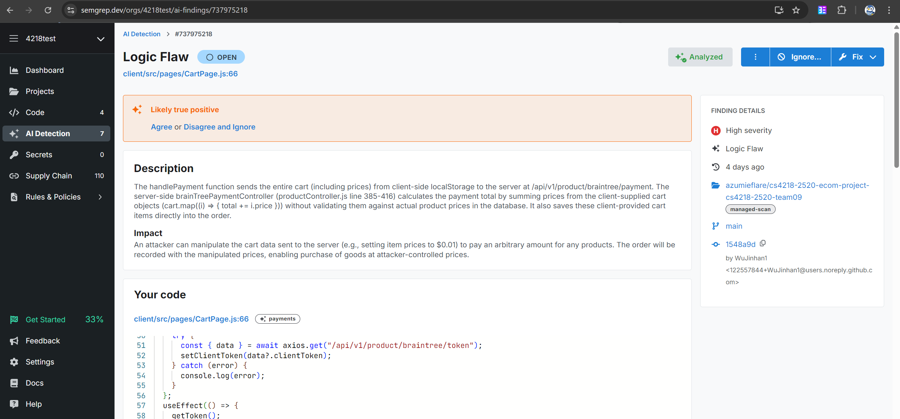
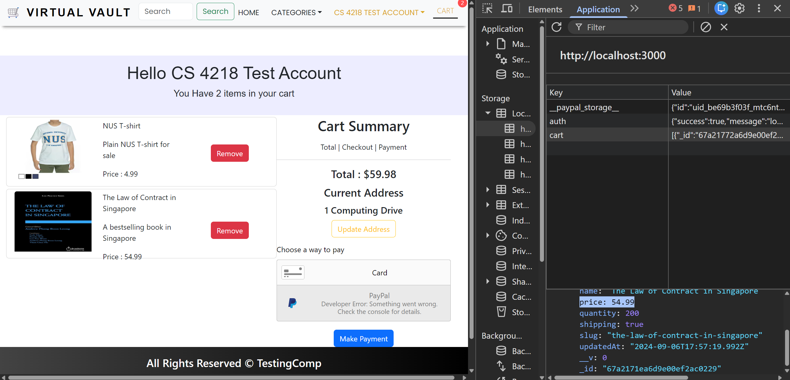

# Security Testing for CartPage

## Test 1 - Client sided cart
This vulnerability was discovered through a scan from an online tool [Semgrep](https://semgrep.dev/).

Since the current logic for CartPage payment system relies on sending the entire cart (including the item's prices) to the backend without verification, the prices of items can be easily modified on the user's localStorage.

Before

After

As shown in the screenshots, the prices can be easily modified by directly editting the value in the localStorage.

### Fix
Instead of trusting the prices on the client side, only send the product id and quantity to the backend so that the prices can be accurately fetched and calculated.

## Test 2 - Logic Flaw
Each product comes with a quantity, denoting how many products are available to purchase. However, this was not checked at all.

### Fix
Implemented checking and updating of quantity for products when user attempts to checkout.

## Test 3 - Sniffing data with Wireshark
Attempt to sniff for any sensitive data over Wireshark.  
While the application runs over http, payment side is done by Braintree, which is sent in https. As such, it is not vulnerable to sniffing attack.

## Test 4 - Modifying data sent with Burp Suite
Using Burp Suite to intercept requests and forwarding it to the backend.  
While we can manually change the values to be sent to the backend, the backend has been fixed by test 1 to verify the data from backend, as such this is not vulnerable to packet manipulation.