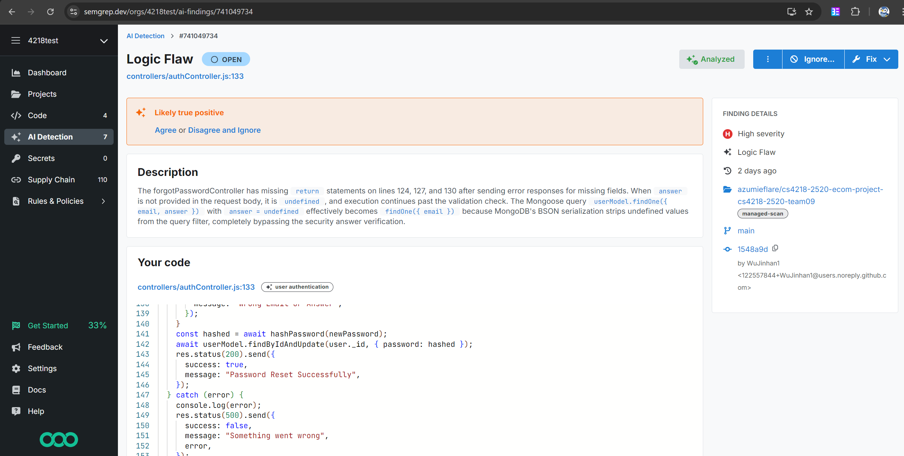
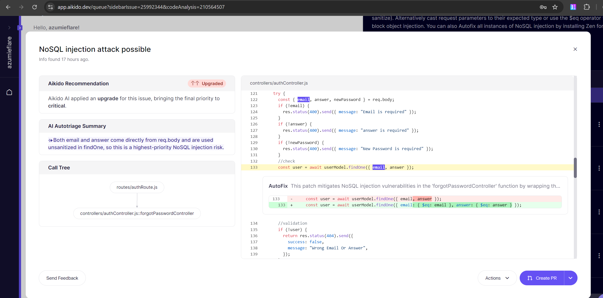
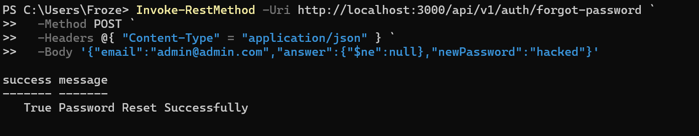

# Secrity Testing for forgetPasswordController

#### Note: Since the frontend for forgetPasswordController was not implemented, the API could only be directly accessed through CLI and not through the frontend.

## Test 1 - Logic Flaw
This vulnerability was discovered through a scan from an online tool [Semgrep](https://semgrep.dev/).


From the scan, we can see that a logic flaw was present where missing return could cause the code to continue running when it should not. 

### Fix
Add the missing returns to the respective lines

## Test 2 - NoSQL injection
This vulnerability was discovered through a scan from a online tool [Aikido](https://www.aikido.dev/).


From the scan, we can see that there is a potential NoSQL injection risk in the forgetPasswordController function.

Furthermore, this vulnerablity can be exploited and explicated.

By running the following code in powershell,

```
Invoke-RestMethod -Uri http://localhost:3000/api/v1/auth/forgot-password `
  -Method POST `
  -Headers @{ "Content-Type" = "application/json" } `
  -Body '{"email":"admin@admin.com","answer":{"$ne":null},"newPassword":"hacked"}' 
```

we can bypass the security question requirement, and effectively reset the password of ANY email desired. This exploits the NoSQL injection vulnerability by changing the check restriction of the security question to check for answer != null instead, which is by default true.



With this exploit, we can change the password of any known email (or do the same "$ne":null for email to default to first user found), and gain access to accounts that we should not have access to.

### Fix
Apply the fix as recommended by Aikido, to change intepretation of the inputs as literal values. 
