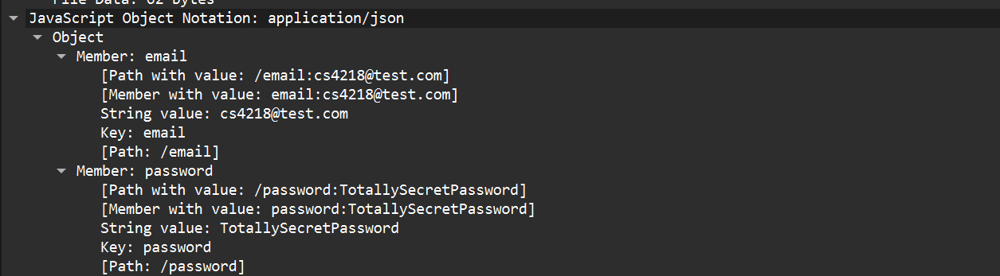
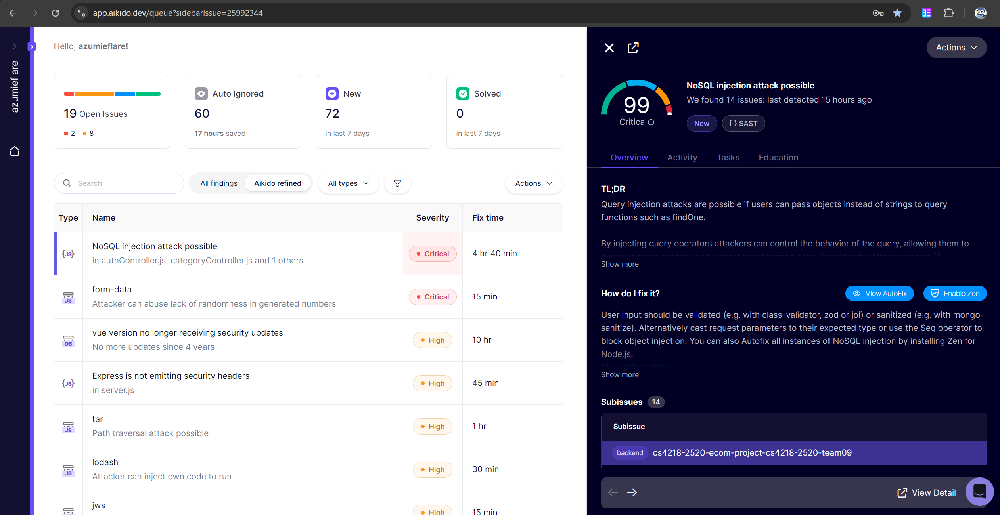
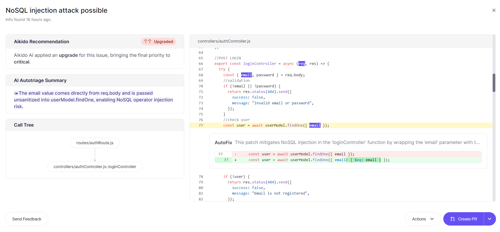

# Secrity Testing for login page

## Test 1 - Attempt Login

### Test 1.1 - Error Messages
Two scenarios can occur here:

1. Invalid Email
2. Valid Email but Invalid Password

Testing will be done for both possible scenarios.  

In the event of Invalid Email, we get the error message:   <strong>Something went wrong </strong>  

However, with a Valid Email but Invalid Password, we get the error message:  
<strong> Invalid Password </strong>  

This is a security violation as attackers can effectively brute force and guess valid email addresses by checking the error message. 

### Fix
Ensure a common error message for both cases.

### Test 1.2 - Lack of login attempt rate limiting
There is no limit on how many times a user can attempt to login. This makes the application vulnerable to brute force attacks, which effective allows the attacker to endlessly guess login details, and even possibly cause a DoS on the application

### Fix
Add /middlewares/rateLimiter.js and modified /routes/authRoute.js to use the rate limiter.  
This prevents attackers from brute forcing.

## Test 2 - Lack of https
Due to the lack of https, data sent through the application can be seen in plain form  

As in the image of a Wireshark packet capture, the email and password can be seen easily by anyone who managed to sniff the packet.

### Fix
Enable https to allow for encryption of data sent. (Not applied)

## Test 3 - Potential NoSQL Injection Vulnerability
This vulnerability was discovered through a scan from an online tool [Aikido](https://www.aikido.dev/).

From the scan, we can see that authController.js, specifically the loginController function is possibly vulnerable to a NoSQL injection.

### Fix
Following the suggestion by Aikido, the fix is applied to treat the user input as a literal value, instead of previously reading user input as a query object which could bypass authentication.

## Test 4 - Bypass frontend validation with Burp Suite
When attempting to login from the normal login page, there are regex checks for email.  
However, this can be bypassed by intercepting and modifying the packets with Burp Suite.    

While this could bypass the regex check, the NoSQL injection vulnerability has been previously tested and fixed, rendering this not a vulnerability as it can not be further exploited. If https is enabled, the packet would also be un-readable as TLS would encrypt the packets. 

## Test 5 - Login bypass with LocalStorage
Currently, there are no defensive measures taken on the use of the auth JWT tokens. This makes it vulnerable to replay attacks, where attack can obtain another user's JWT token and reuse it to disguise as that user instead.

### Fix
Change JWT's expiry to 15min (instead of 7days).
A better fix would be to bind JWT tokens to session or device ID, but this would require an overhaul of many implementations and tests, and thus not implemented.
Else, https can be enabled to prevent stealing of JWT token.
