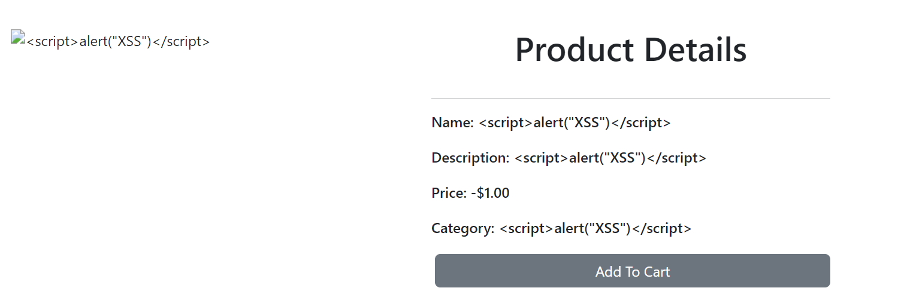
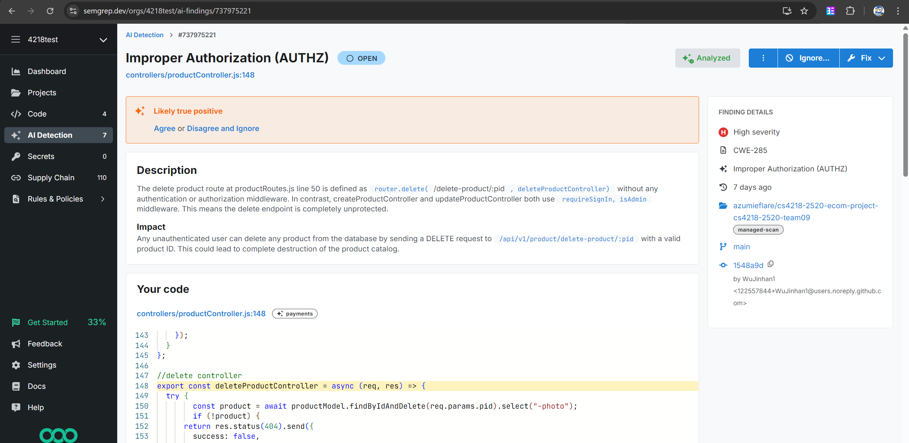
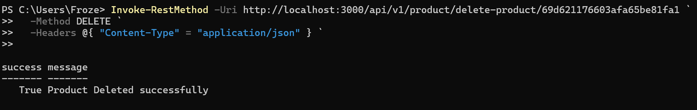

# Secrity Testing for productController (create, delete, update product)

## Test 1 - Stored XSS test
Input fields with \<script\> tags, and see if the application is vulnerable to stored XSS. <br>
On creating or updating a product with \<script\>alert("XSS")\</script>\, we can see that it is properly displayed as a literal and not showing an alert, thus not vulnerable to stored XSS.


## Test 2 - Invalid values
Certain fields are not checked for invalid values. For example, price and quantity can be negative, while image format is not checked. Applicable to create and update product.

## Fix
Properly validate the fields before creating the product.

## Test 3 - Deleting product without authorization
This vulnerability was discovered through a scan from an online tool [Semgrep](https://semgrep.dev/).



Currently, API calls to delete products are not properly authenticated, allowing anyone to delete any product. This can be easily replicatable by running the following command on powershell: <br>

```
Invoke-RestMethod -Uri http://localhost:3000/api/v1/product/delete-product/69d621176603afa65be81fa1 `
  -Method DELETE `
  -Headers @{ "Content-Type" = "application/json" } `

```

To get the product ID of any product, simply add that item into cart and view local storage. 



### Fix
Configure the routes for delete product to require Sign In and Admin. 