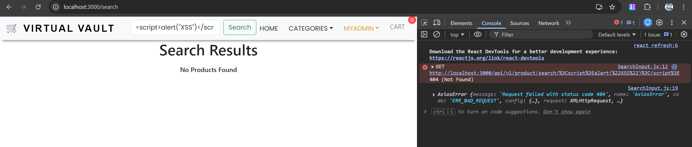
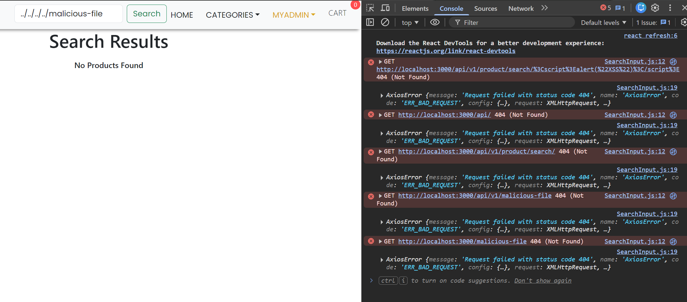

# Security testing for searchInput

## Test 1 - XSS test
Try to input \<script\> tags into the search bar and test if it is vulnerable to XSS.

On checking the console, we can see that the angle brackets are safely encoded. Additionally, the page does not reflect the searched input, thus unlikely to be vulnerable to XSS. However, from the error in the console, it raises another potential vulnerability.

## Test 2 - Path traversal
From the screenshot in test 1, we can see that slashes (/) are interpreted as it is, thus the input might be vulnerable to path traversal.

From the screenshot, we can see that by varying the input with (../), we can essentially traverse through the file system, and potentially access files that we should not have access to. A malformed search input could also possibly crash the application. 

### Fix
Properly encode the input on the frontend to prevent any loading of unsanitized inputs. 